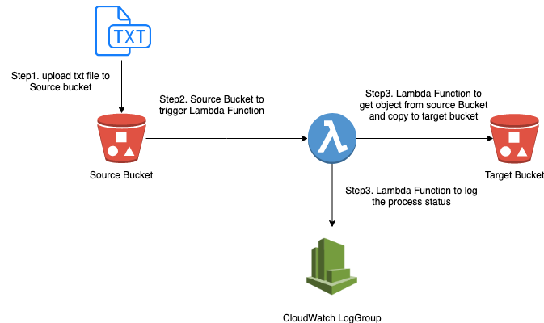

# Get Started
### Deploy a bucket for following deployment
#### 1) Directory
```
cd homework-basic
```
#### 2) deploy the deployment bucketed `yyl-deployment-bucket`
```
./auto/yyl-deployment-bucket
```

# Homework
## 1. Basic 

### When create or update a txt file to source bucket, it can trigger the lambda function to copy the txt file to target bucket


### Scripts
#### Directory
```
cd homework-basic
```

#### Deploy resources to AWS
```
./auto/deploy  
```

#### Local testing the lambda function to copy .txt file from one bucket to another bucket
```
npm run local-test
```

## 2. Advanced - 1 - AWS lambda can consume event from SNS

### Scripts

#### Directory
```
cd homework-advanced-1-lambda-consume-event-from-sns
```

#### Deploy resources to AWS
```
./auto/deploy 
```

## 3. Advanced - 2 - AWS Cloudwatch event trigger lambda

### Scripts
#### Directory
```
cd homework-advanced-2-cloudwatch-event-trigger-lambda
```

#### Deploy resources to AWS
```
./auto/deploy
```